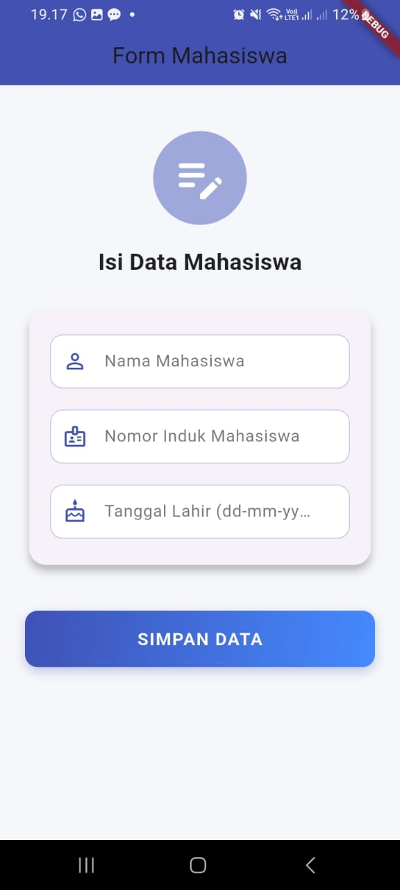
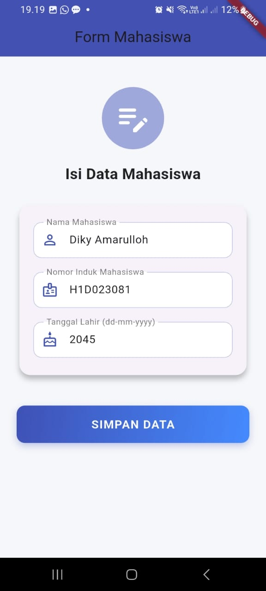

Nama    : Diky Amarulloh
NIM     : H1D023081

Penjelasan : 
Pertama, pengguna mengisikan data  nama, NIM, dan tahun lahir di form, semua teks yang diketik dan akan otomatis disimpan di TextEditingController. lalu klik tombol Simpan, isi dari masing-masing controller itu diambil dan disimpan ke variabel. Setelah itu, data tadi dikirim ke halaman MahasiswaDetail lewat konstruktor pake Navigator.push(), jadi halaman baru muncul sambil bawa data yang udah diisi tadi. Di halaman detail, data yang dikirim itu diterima lewat parameter konstruktor, terus akan ditampilkan, kurang lebih alurnya akan seperti ini: isi form → tekan simpan → pindah ke halaman detail → data langsung muncul di layar.

tampilan SS:

